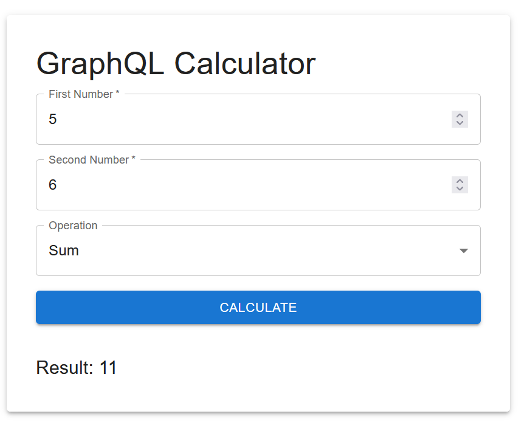

# Calculator API

## Author: Christian Hindremäe

## Description

This is a simple Calculator App built using Typescript and GraphQL. It can be used both in GraphQL playground as well as in a simple Web UI built using React and MUI.

## Features

* GraphQL API for calculation operations, with division by zero check
* Simple clean calculator UI
* Docker setup for quickly launching the application using "docker-compose up"
* Unit tests for calculator API, 100% coverage (checked using nyc)
* IP-based rate limiting for Multiply call

## Use instructions

1. Clone the Github repository (Delfi-yl)
2. Inside root directory, enter command "docker-compose up"
3. After few moments, the server is accessible on http://localhost:4000/graphql  and client is accessible on http://localhost:5173

## Tech stack
* GraphQL + Apollo
* Node v23
* Typescript
* React (Vite app) + MUI
* Mocha + chai for testing